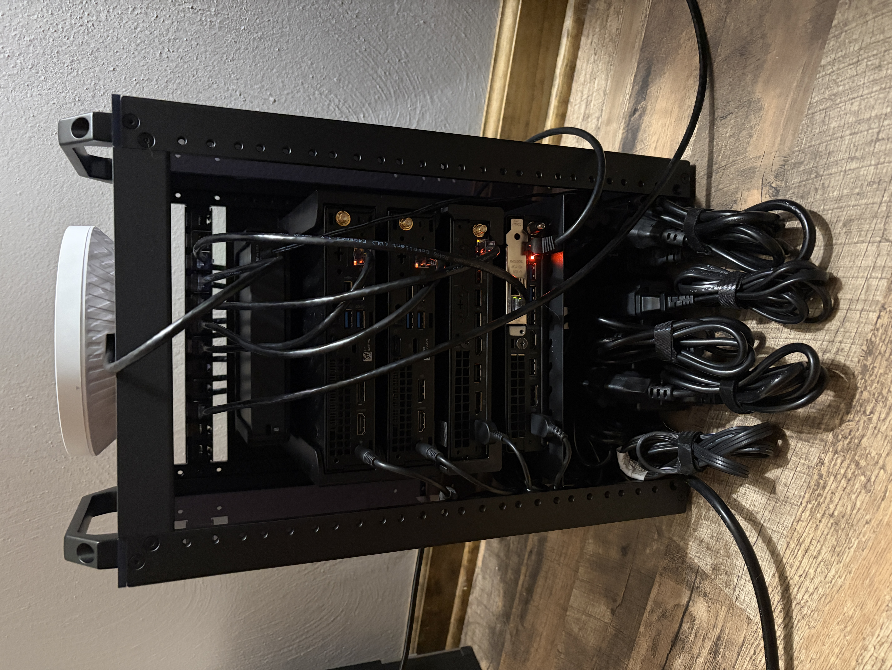

# DeskPi RackMate T1 Plus Build & Physical Cabling

This document details the physical assembly, rack unit allocation, patch panel terminations, and switch port layout for the DeskPi RackMate T1 Plus 10" 8U server rack.

---

 
## Physical Rack Layout (8U Allocation)

The DeskPi RackMate T1 Plus houses the core networking equipment, primary router, and compute nodes in a compact 10" form factor.

| Unit (U) | Component                           | Description / Notes                           |
| :------- | :---------------------------------- | :-------------------------------------------- |
| **U8**   | 12-Port Cat6 Keystone Patch Panel   | Front-facing terminations for all LAN cabling |
| **U7**   | TP-Link TL-SG108PE                  | Core L2 Gigabit Managed Switch (4-Port PoE)   |
| **U6**   | Dell OptiPlex 3060 Micro (`PVE 01`) | Proxmox Virtualization Node 01                |
| **U5**   | Dell OptiPlex 3060 Micro (`PVE 02`) | Proxmox Virtualization Node 02                |
| **U4**   | Lenovo ThinkCentre M60e Tiny        | TBD                                           |
| **U3**   | Lenovo ThinkCentre M720q Tiny       | OPNsense Router                               |
| **U2**   | Blank                               | Cable management & airflow                    |
| **U1**   | Power Distribution & Cable Storage  | Power wiring & cable management               |

**Note:** The Micro-ATX tower host (`PVE 03`) sits externally alongside the DeskPi rack and connects via CAT6 patch cabling.

---

## Switch & Patch Panel Ports

The **TP-Link TL-SG108PE** serves as the central Layer 2 interconnect. Ports 1–4 support PoE, while Ports 5–8 provide standard Gigabit Ethernet links. 

Cabling from Switch Ports 1–8 routes 1:1 into Patch Panel Ports 3–10 using 6" CAT6 patch cords before terminating at host devices.

**Note:** The upstream ISP WAN link from the Xfinity Gateway bypasses the patch panel entirely and plugs directly into the onboard OPNsense Ethernet port (`em0`).

| Switch Port | Patch Port | PoE | Connected Host / Device       | Target Interface    | Function            | VLAN ID |
| :---------: | :--------: | :-: | :---------------------------- | :------------------ | :------------------ | ------- |
| **Port 1**  |   Port 3   | No  | OPNsense Router               | `igb0` (LAN Port 1) | Core Router         | 10      |
| **Port 2**  |   Port 4   | Yes | TP-Link Omada EAP650          | Onboard GbE         | Wireless AP         | 10      |
| **Port 3**  |   Port 5   | No  | Lenovo M60e Tiny              | Onboard GbE         | TBD                 | 10      |
| **Port 4**  |   Port 6   | No  | Dell OptiPlex 3060 (`PVE 01`) | Onboard GbE         | Proxmox Node 01     | 10      |
| **Port 5**  |   Port 7   | No  | Dell OptiPlex 3060 (`PVE 02`) | Onboard GbE         | Proxmox Node 02     | 10      |
| **Port 6**  |   Port 8   | No  | Micro-ATX Tower (`PVE 03`)    | Onboard GbE         | Proxmox Node 03     | 10      |
| **Port 7**  |   Port 9   | No  | *Spare*                       | -                   | -                   | 1       |
| **Port 8**  |  Port 10   | No  | Primary Workstation           | Onboard GbE         | Primary Workstation | 20      |

---

## Cabling & Physical Standards

* **Termination Standard:** T568B on all CAT6 keystone jacks.
* **Patch Cables:** 6" CAT6 cords between switch and patch panel.