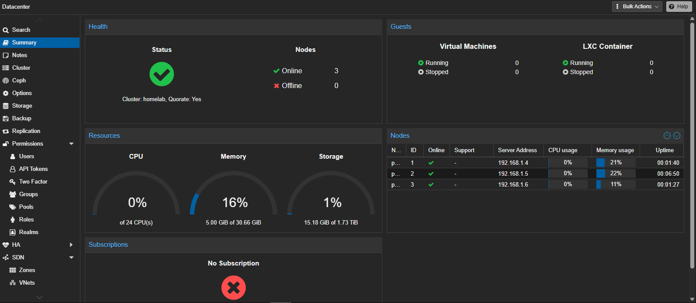

# Proxmox VE Cluster Nodes

This document details the configuration, hardware specifications, network bridge design, and storage pool allocation for the 3-node Proxmox Virtualization Environment (PVE) cluster.

---

## Cluster Overview & Host Specifications

The cluster consists of two compact micro nodes (`PVE 01`, `PVE 02`) housed within the DeskPi 8U rack, paired with a Micro-ATX tower (`PVE 03`) for more resource-intensive workloads.

| Hostname     | Node Role                   | Hardware / Form Factor   | CPU / RAM           | Primary Storage        | Management IP |
| :----------- | :-------------------------- | :----------------------- | :------------------ | :--------------------- | :------------ |
| **`pve-01`** | Compute / Cluster Member    | Dell OptiPlex 3060 Micro | i5-8500T / 8GB DDR4 | 256GB NVMe + 500GB SSD | `192.168.1.4` |
| **`pve-02`** | Compute / Cluster Member    | Dell OptiPlex 3060 Micro | i5-8500T / 8GB DDR4 | 256GB NVMe + 500GB SSD | `192.168.1.5` |
| **`pve-03`** | High-Compute / Storage Host | Micro-ATX Tower          | i7-8700 / 16GB DDR4 | 256GB NVMe + 1TB HDD   | `192.168.1.6` |

---

## Network Bridge & Virtual Switch Configuration

Each node uses a standard Proxmox Linux Bridge (`vmbr0`) mapped to the host's primary physical Ethernet interface.

All three nodes follow a standardized bridge setup on their primary GbE interfaces:

| Node         | Interface | Type         | IP Address       | Gateway       | Subnet Mask     | Associated Bridge |
| :----------- | :-------- | :----------- | :--------------- | :------------ | :-------------- | :---------------- |
| **`pve-01`** | `nic0`    | Physical     | Default          | N/A           | N/A             | `vmbr0`           |
|              | `vmbr0`   | Linux Bridge | `192.168.1.4/24` | `192.168.1.1` | `255.255.255.0` | Mapped to `nic0`  |
| **`pve-02`** | `nic0`    | Physical     | Default          | N/A           | N/A             | `vmbr0`           |
|              | `vmbr0`   | Linux Bridge | `192.168.1.5/24` | `192.168.1.1` | `255.255.255.0` | Mapped to `nic0`  |
| **`pve-03`** | `nic0`    | Physical     | Default          | N/A           | N/A             | `vmbr0`           |
|              | `vmbr0`   | Linux Bridge | `192.168.1.6/24` | `192.168.1.1` | `255.255.255.0` | Mapped to `nic0`  |

---

## Storage Pools & Datastores

| Node         | Storage ID  | Storage Type   | Capacity | Content Types       |
| :----------- | :---------- | :------------- | :------- | :------------------ |
| **`pve-01`** | `local`     | Directory      | 72.8GB   | ISO Images, Backups |
|              | `local-lvm` | LVM-Thin       | 152GB    | VM Disks            |
| **`pve-02`** | `local`     | Directory      | 72.8GB   | ISO Images, Backups |
|              | `local-lvm` | LVM-Thin       | 152GB    | VM Disks            |
| **`pve-03`** | `local`     | Directory      | 72.7GB   | ISO Images, Backups |
|              | `local-lvm` | LVM-Thin       | 151.6GB  | VM Disks            |
|              | `data-01`   | ext4 Directory | 983.3GB  | TBD                 |
|              | `data-02`   | ext4 Directory | 245GB    | TBD                 |
