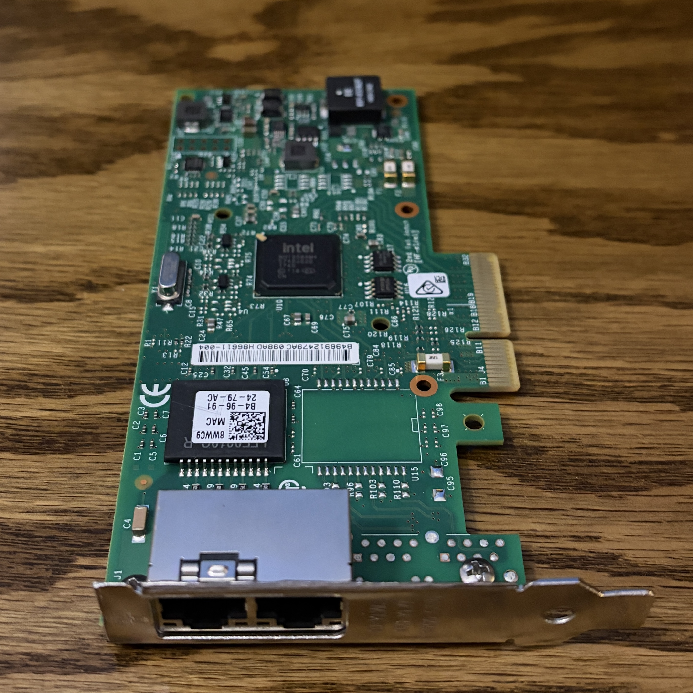
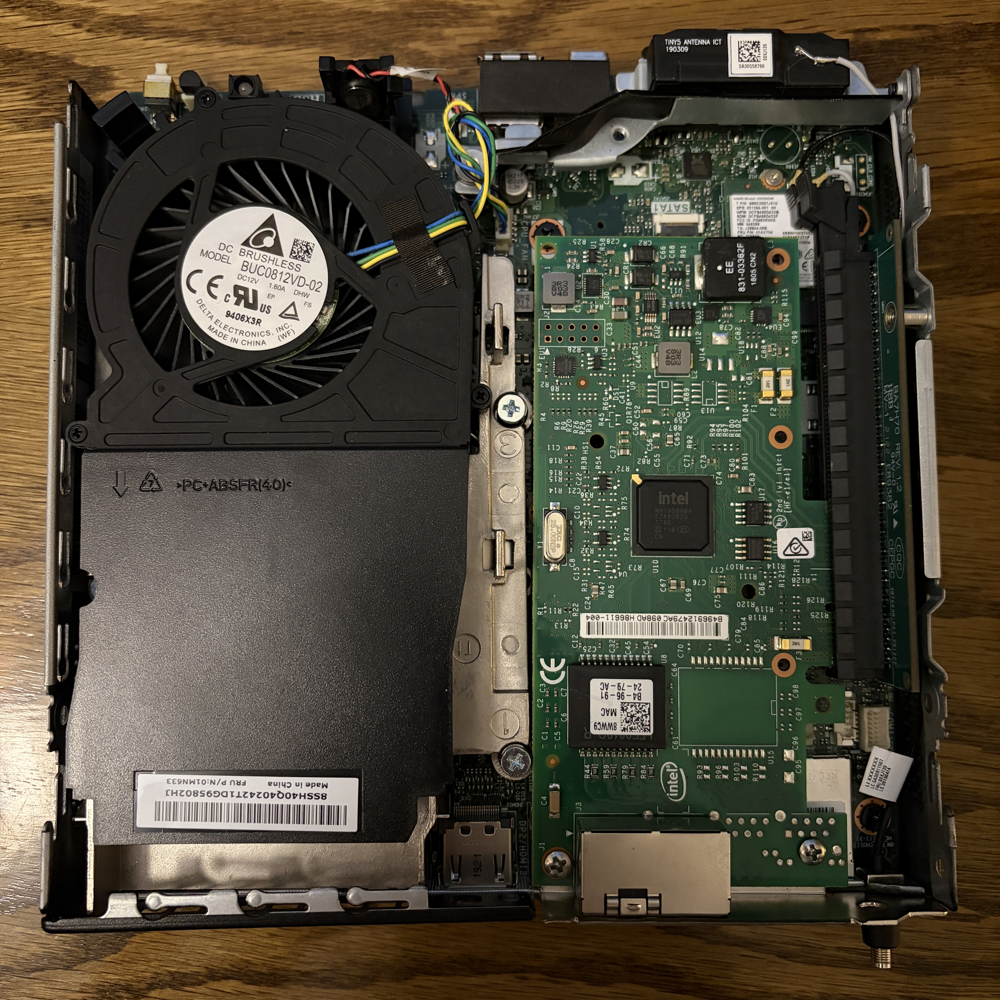
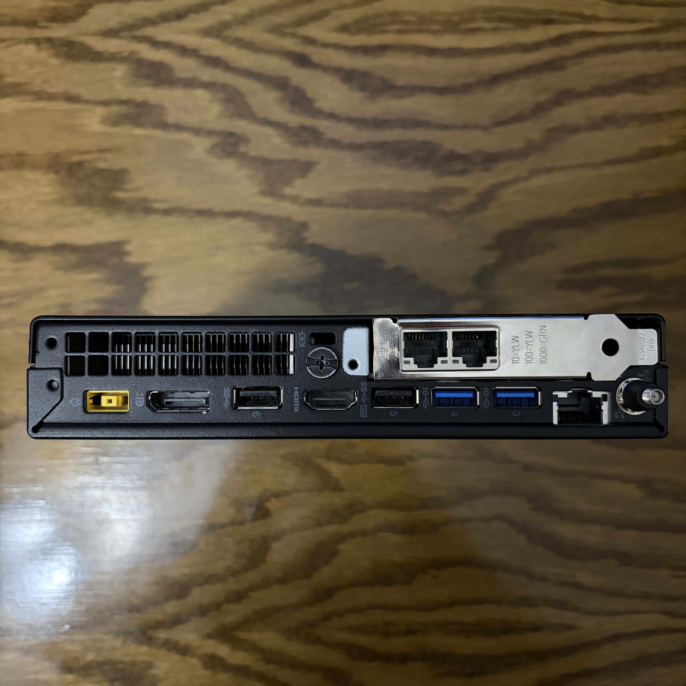
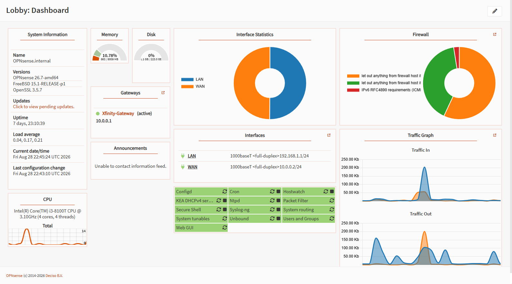

# OPNsense Router Setup

This document details the hardware modification, installation, and network configuration of the primary router built on a Lenovo ThinkCentre M720q Tiny.

---

## Hardware Setup & Physical Modifications

To transform the M720q Tiny into a dual-interface router capable of gigabit throughput, dedicated network ports were added via a PCIe expansion card.

### Hardware Components
* **Host:** Lenovo ThinkCentre M720q Tiny (Intel i3-8100T, 8GB RAM, 256GB NVMe SSD)
* **Expansion Riser:** PCIe Expansion Riser Card 01AJ940 (x16 slot)
* **Network Interface Card (NIC):** Intel I350-T2 Dual-Port Gigabit Low Profile Ethernet Adapter 8WWC9

### Physical Modifications
* **Bracket & Shield Modification:** Due to strict clearance constraints inside the chassis, the Intel I350-T2 bracket required custom cutting and grinding to fit within the rear I/O cutout of the M720q casing.

---

## Network Interface Mapping

With the Intel I350-T2 installed, interface roles were designated as follows:

| Physical Port    | Interface Name | Driver | Connected To       | Role                       |
| :--------------- | :------------- | :----- | :----------------- | :------------------------- |
| **Onboard Port** | `WAN`          | `em0`  | Xfinity Gateway    | Upstream ISP Port          |
| **I350 Port 1**  | `LAN`          | `igb0` | TP-Link TL-SG108PE | Main Internal Switch Trunk |
| **I350 Port 2**  | Unused         | `igb1` | Disconnected       | OPT                        |

---

## Initial Configuration & WAN Handoff

### Upstream Link & DMZ Placement
1. **Physical Connection:** The onboard `em0` interface connects to a LAN port on the Xfinity Gateway.
2. **Static Addressing:** The `em0` WAN interface is assigned a static IP (`10.0.0.2`) within the Xfinity Gateway's IP range (`10.0.0.0/24`).
3. **DMZ Configuration:** The static WAN IP is set as the DMZ host in the Xfinity Gateway. This acts as a default port forward, passing all unsolicited inbound WAN traffic directly to OPNsense so firewall rules and port forwards only need to be managed in one place.
4. **Stateful Perimeter Security:** OPNsense acts as the stateful firewall for the homelab. Using its out-of-the-box default rule base, it automatically blocks all unsolicited inbound connections from the upstream `10.0.0.0/24` network into the lab, while allowing lab devices on `igb0` outbound access.
### Core Services Configured
* **Default Gateway:** OPNsense serves as the default gateway for all internal subnets.
* **DHCP Server:** Configured on `igb0` to issue dynamic leases to hypervisors and infrastructure.
* **DNS Resolution:** Unbound DNS service running on default settings for outbound caching and recursive resolution.

