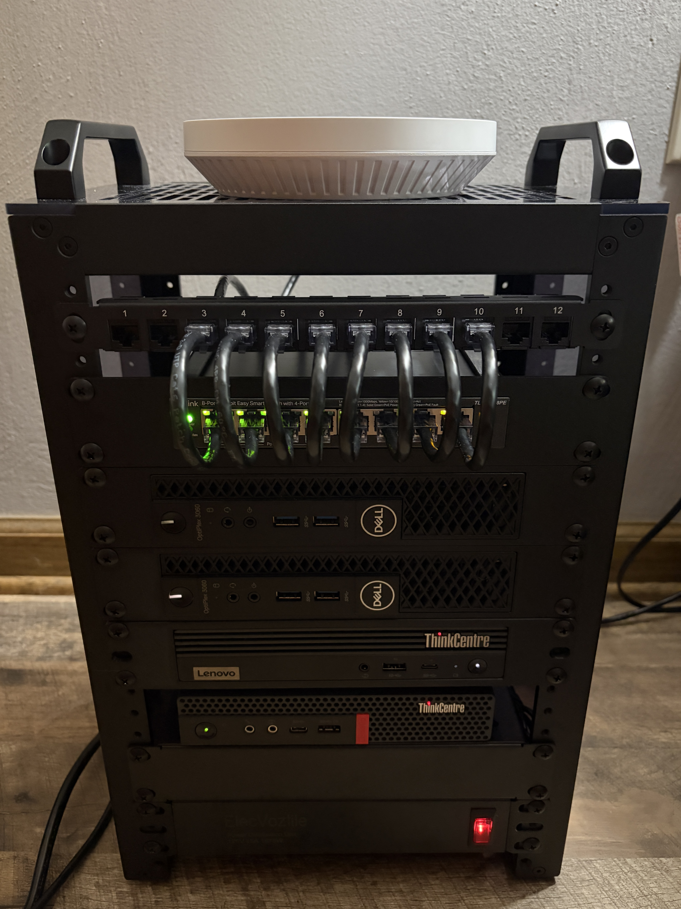

# Personal Homelab & Network Infrastructure

Welcome to my homelab documentation. This repository tracks the physical infrastructure, network architecture, and hypervisor configurations supporting my home environment.

---

## Repository Quick Navigation

* [Physical Build & Cabling](Hardware/Rack-Build.md)
* [OPNsense Router Setup](Network/OPNsense-Setup.md)
* [Proxmox Virtualization Cluster](Proxmox-Overview.md)

## Hardware Inventory

| Device          | Specifications                                                 | Role                      | OS                 |
| :-------------- | :------------------------------------------------------------- | :------------------------ | :----------------- |
| **Router**      | Lenovo ThinkCentre M720q Tiny (i3-8100T, 8GB RAM, 256GB SSD)   | Primary Firewall / Router | OPNsense           |
| **Core Switch** | TP-Link TL-SG108PE (8-Port GbE with 4-Port PoE)                | L2 Switching & PoE        | Managed Firmware   |
| **Wireless AP** | TP-Link Omada EAP650                                           | Wi-Fi Coverage            | Standalone / Omada |
| **PVE 01**      | Dell OptiPlex 3060 Micro (i5-8500T, 24GB RAM, 256GB SSD)       | Virtualization Host       | Proxmox VE         |
| **PVE 02**      | Dell OptiPlex 3060 Micro (i5-8500T, 24GB RAM, 256GB SSD)       | Virtualization Host       | Proxmox VE         |
| **PVE 03**      | Custom Tower (i7-8700, GTX 1060, 16GB RAM, 256GB SSD, 1TB HDD) | Virtualization Host       | Proxmox VE         |
| **M60e**        | Lenovo ThinkCentre M60e Tiny (i3-1005G1, 16GB RAM, 256GB SSD)  | TBD                       | TBD                |

---

## Current Physical & Network Setup

* **Rack & Wiring:** DeskPi RackMate T1 Plus 10" 8U Server Rack featuring a CAT6 patch panel with patch cord connections to switch and rear patch cord exits.
* **Routing & Firewall:** OPNsense on the M720q Tiny handles the WAN handoff from an Xfinity Gateway, core routing, and DHCP.
* **Virtualization Core:** Proxmox VE deployed across three nodes (two OptiPlex 3060 Micro nodes and one custom tower host) for VM and container workloads.

**Note:** Specific host IP addresses and third/fourth octets have been simplified (`x`) for privacy and security.