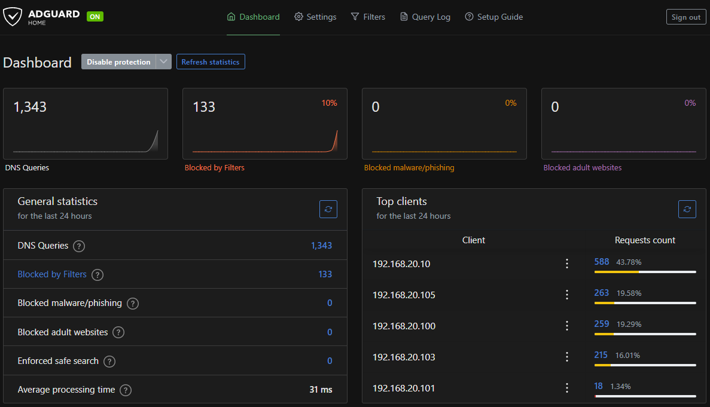

# AdGuard Home Redundant DNS Deployment

This document details the configuration, deployment, and network integration of redundant AdGuard Home DNS Servers across the Proxmox VE cluster nodes (`pve-01` and `pve-02`), integrated with OPNsense Kea DHCPv4 and inter-VLAN firewall rules.

---

## Proxmox LXC Container Setup

Deploy one LXC container per node on `local-lvm` storage mapped to the standard `vmbr0` Linux bridge.

### 1. Template Download
On both `pve-01` and `pve-02`:
* Navigate to `local` storage > **CT Templates** > **Templates**.
* Download `debian-13-standard`.

### 2. Container Specifications

| Specification           | Primary Node (`pve-01`)                 | Secondary Node (`pve-02`)               |
| :---------------------- | :-------------------------------------- | :-------------------------------------- |
| **CT ID**               | `120`                                   | `121`                                   |
| **Hostname**            | `adguard-1`                             | `adguard-2`                             |
| **Type**                | Unprivileged Container                  | Unprivileged Container                  |
| **CPU**                 | 1 vCPU                                  | 1 vCPU                                  |
| **Memory / Swap**       | 512 MB RAM / 512 MB Swap                | 512 MB RAM / 512 MB Swap                |
| **Root Disk**           | 8 GB (`local-lvm`)                      | 8 GB (`local-lvm`)                      |
| **Bridge Interface**    | `vmbr0`                                 | `vmbr0`                                 |
| **IPv4 Address / CIDR** | `192.168.10.20/24`                      | `192.168.10.21/24`                      |
| **Gateway (IPv4)**      | `192.168.10.1`                          | `192.168.10.1`                          |

---

## AdGuard Home Installation & Setup

1. Update packages, install curl, and run automated install script from https://github.com/AdguardTeam/AdGuardHome#automated-install-linux-and-mac.

```
apt update && apt upgrade -y
apt install curl -y
curl -s -S -L https://raw.githubusercontent.com/AdguardTeam/AdGuardHome/master/scripts/install.sh | sh -s -- -v
```

### Initial Service Configuration
1. Access the web setup wizard:
   * Node 1: `http://192.168.10.20:3000`
   * Node 2: `http://192.168.10.21:3000`
2. **Web Interface:** Listen on `All interfaces` on port `3000`.
3. **DNS Server:** Listen on `All interfaces` on port `53`.
4. Create the administrative credentials.

---

## OPNsense Kea DHCPv4 Integration

To distribute both AdGuard instances to client subnets, such as TRUSTED, configuration changes were required in Kea DHCP and Firewall rules.

### 1. Define DNS Servers for TRUSTED Subnet
1. Go to **Services > Kea DHCP > Kea DHCPv4**.
2. Edit 192.168.20.0/24 in **Subnets**.
3. Uncheck **Auto collect option data**.
4. Added 192.168.10.20 & 192.168.10.21 for **DNS Servers**.

---

## Firewall Rule Change

Because AdGuard instances are in **VLAN 10 (MGMT)** and primary clients are in **VLAN 20 (TRUSTED)**, DNS requests to **MGMT** from **TRUSTED** were permitted.

### Rule Parameters

|  Action  | Protocol     | Source             | Destination  | Destination Port | Description                                |
| :------: | :----------- | :----------------- | :----------- | :--------------- | :----------------------------------------- |
| **Pass** | IPv4 TCP/UDP | TRUSTED network    | MGMT network | 53 (DNS)         | Allow TRUSTED DNS access to MGMT           |

**Note:** The DNS allow rule is evaluated before the strict `!RFC1918` inter-VLAN block rule, ensuring port 53 traffic to `192.168.10.20` and `192.168.10.21` is passed rather than dropped.

---

## Verification & Testing

1. **Verify DHCP Lease on Workstation (Switch Port 8 / VLAN 20):**
   ```
   ipconfig /renew
   ipconfig /all
   ```
   Confirmed both `192.168.10.20` and `192.168.10.21` appear under `DNS Servers`.

2. **Check Live Query Logs:**
   Navigate to the web dashboard of both instances (`192.168.10.20` and `192.168.10.21`) to verify client queries originating from `192.168.20.x`.


